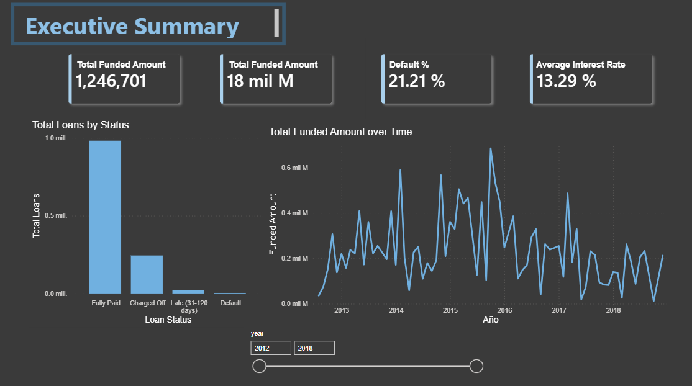
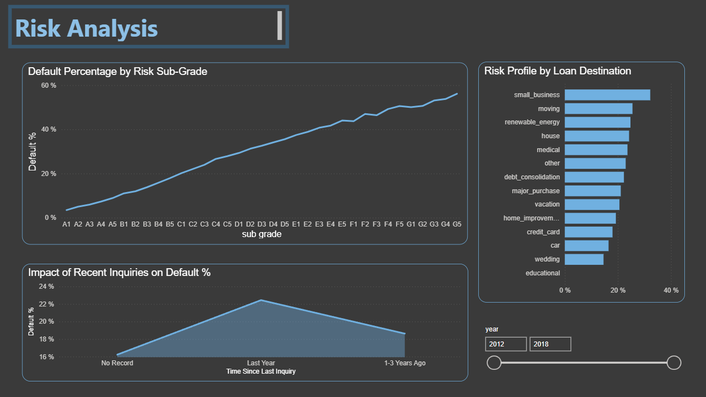
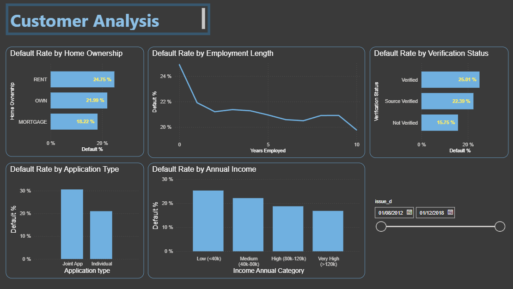
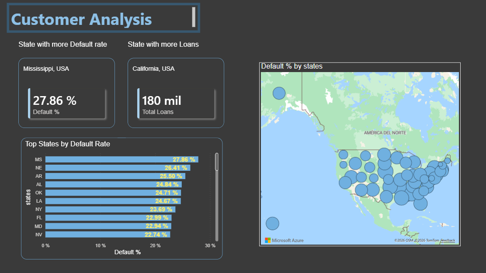

# Credit Risk Analysis
> Loan default risk analysis using Python, SQL (DuckDB), and Power BI.

**Project Progress:** ▓▓▓▓▓▓▓▓▓▓ **95% Complete**

## 🚧 Current Status / Roadmap
*This project is nearing completion. Core pipelines are built, and the initial Power BI executive dashboard is live.*

- [x] **Phase 1:** Data Extraction and Initial Cleaning (Python/Pandas)
- [x] **Phase 2:** Dimensional Modeling (Bronze → Silver → Gold Architecture)
- [x] **Phase 3:** Exploratory Data Analysis & SQL Analytics (DuckDB)
- [x] **Phase 4:** Power BI Dashboard Implementation *(Executive Summary & Customer Analysis complete)*
- [ ] **Phase 5:** Final Dashboard Views (Risk Deep-Dive & Temporal Analysis) and Deployment

---

## 📈 Dashboard Preview

### Executive Summary

---

## 📊 Key Insights (SQL Analytics)
Based on the analytical queries performed on the processed data, several critical risk patterns have been identified:

* **Credit Grades as Predictors:** Loan grades assigned by LendingClub are strong predictors of default. Grade A loans show a default rate below 5%, while Grade G loans exceed 55% — an 11x difference.
* **Risk by Loan Purpose:** Small business loans show the highest default rate, significantly above the 21.21% average — nearly double compared to lower-risk categories like wedding or car loans.
* **Geographical Concentration:** Mississippi (MS) shows the highest default rate at ~28%, followed by Nebraska (NE) and Arkansas (AR). Southern and Midwestern states tend to concentrate higher credit risk.
* **Temporal Trends & Truncation:** Default rates show a steady increase from 2012 to 2016, peaking above 26% in 2016-Q2 and 2016-Q3. The drop in 2018-Q4 is likely due to data truncation — recent loans haven't reached their final status yet.
* **Income-Default Correlation:** There is a clear inverse relationship between income and default rate. Low-income borrowers (<$40k) default at 25.4%, while very high-income borrowers (>$120k) default at only 16.8% — suggesting income is a strong predictor of repayment capacity.
* **Verification Paradox:** Counterintuitively, "Verified" borrowers default more (25%) than "Not Verified" ones (15.75%). This is explained by FICO scores — unverified borrowers have higher average FICO (704 vs 692), suggesting LendingClub only requested income verification from higher-risk applicants.

---

## 📖 Overview
Analysis of LendingClub loan data (2007-2018) to identify credit risk patterns and default behavior across 1.2M+ loans.

## 🛠 Stack
- **Python / Pandas** — ETL (Extract, Transform, Load) and EDA
- **DuckDB** — Fast analytical SQL processing
- **Power BI** — Interactive Dashboarding

## 🏗 Architecture
**Data Lakehouse Approach:** Raw Data (Bronze) → Cleaned Data (Silver) → Star Schema (Gold) → Power BI

## 📂 Dataset
* **Source:** [LendingClub Loan Data — Kaggle](https://www.kaggle.com/datasets/wordsforthewise/lending-club)  
* **Size:** 2.2M loans | 151 columns  
* **Timeframe:** 2007–2018  

## 📁 Repository Structure

    ├── data/
    │   ├── bronze/     # Raw, unprocessed data
    │   ├── silver/     # Cleaned and filtered data
    │   └── gold/       # Dimensional model ready for BI
    ├── notebooks/      # Jupyter notebooks for EDA and ETL
    ├── dashboard/      # Power BI (.pbix) files
    └── images/         # Dashboard screenshots and charts

---

## 📓 Notebooks (View Online)
If GitHub's native viewer is having trouble rendering the notebooks, you can view them instantly here:

* [01. Exploratory Data Analysis (EDA)](https://nbviewer.org/github/AlexanderSc21/credit-risk-analysis/blob/main/notebooks/01_eda.ipynb)
* [02. Dimensional Modeling (Gold Layer)](https://nbviewer.org/github/AlexanderSc21/credit-risk-analysis/blob/main/notebooks/02_gold.ipynb)
* [03. Data Validation](https://nbviewer.org/github/AlexanderSc21/credit-risk-analysis/blob/main/notebooks/03_data_validation.ipynb)
* [04. SQL Analytics](https://nbviewer.org/github/AlexanderSc21/credit-risk-analysis/blob/main/notebooks/04_sql_analysis.ipynb)

---
**Author:** Alexander Sinte — [GitHub](https://github.com/AlexanderSc21)